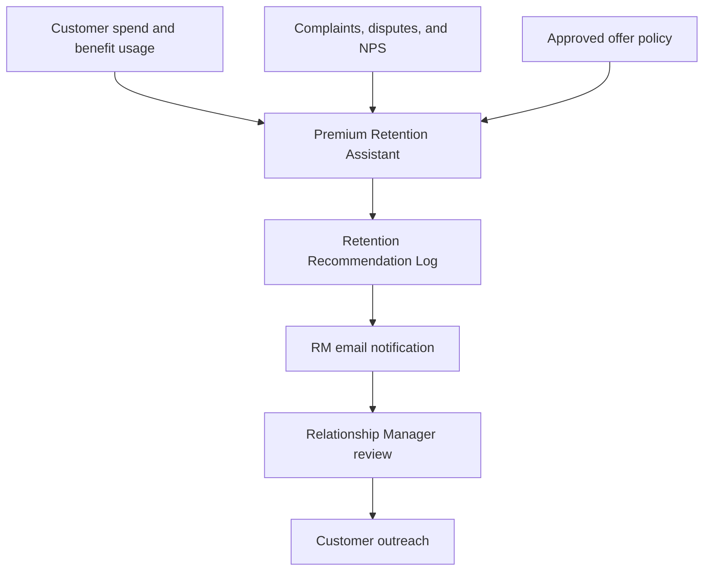

# BankCo Premium Credit Card Retention Assistant

## Overview

This project describes a simple internal assistant that helps BankCo identify premium credit-card customers who may cancel or downgrade their cards when the annual fee becomes due.

The assistant reviews customer activity, explains why a customer may be at risk, checks the bank's approved retention offers, and prepares a recommendation for the assigned Relationship Manager (RM).

The assistant does **not** contact customers or change their accounts. The RM reviews every recommendation and makes the final decision.

## The Problem

Premium credit cards provide benefits such as:

- Airport lounge access
- Concierge services
- Higher rewards
- Travel and dining benefits

Customers pay an annual fee for these benefits. As the renewal date approaches, some customers may cancel or downgrade because:

- They are not using the available benefits.
- Their spending has declined.
- They have not redeemed rewards.
- They experienced a complaint, dispute, or benefit denial.
- They are dissatisfied with the overall service.

Today, RMs may need to examine multiple spreadsheets manually to determine which customers require attention. This takes time and can result in late outreach, generic messages, unsuitable offers, and missed retention opportunities.

## Business Goal

Help RMs contact the right customers before renewal with a relevant and policy-compliant response.

This should help BankCo:

- Improve premium-card renewal rates.
- Reduce preventable cancellations and downgrades.
- Save RM time.
- Avoid unnecessary or overly expensive offers.
- Apply offers consistently.
- Improve the customer experience.

## What the Exercise Requests

The Week 0 exercise does not require coding or a working application. It asks for a design covering:

1. The RM's user problem and BankCo's business goal.
2. Primary and secondary success metrics.
3. Five important customer-risk signals.
4. A six-to-eight-step assistant workflow.
5. A simple system diagram.
6. An explanation of where human judgment is required.

## Success Measures

### Primary metric

Premium-card renewal rate among customers identified as being at risk.

### Secondary metric

Percentage of recommendations reviewed and actioned by RMs before the annual-fee due date.

### Supporting measures

- Time saved per RM
- Offer acceptance rate
- Recommendation approval rate
- RM edit or override rate
- Policy-compliance accuracy
- Retention cost per customer

## Important Risk Signals

### 1. Annual fee due date

This determines whether a customer is within the required 30-90 day renewal window and how urgently the RM should respond.

### 2. Customer satisfaction score

A negative NPS suggests dissatisfaction. An NPS of -20 or lower is treated as a severe warning sign.

### 3. Recent complaints

Complaints indicate service problems. Two or more complaints within 90 days require immediate attention.

### 4. Change in travel spending

A significant decline may show that the customer is no longer receiving value from the card's travel benefits.

### 5. Reward redemptions

No recent redemptions may indicate that the customer does not understand, use, or value the rewards program.

Other useful fields include total spending, lounge visits, disputes, benefit denials, card tier, tenure, preferred contact method, and previous offer usage.

## Risk Rules

A customer first enters the process only when the annual fee is due within 30-90 days.

The customer is then considered at risk when either condition is met:

### General risk

Any two of the following are true:

- Total 90-day spend is below 4,000.
- Travel share declined by at least 20%.
- No lounge visits occurred in 90 days.
- No rewards were redeemed in 90 days.
- At least one complaint was recorded.
- At least one dispute was recorded.
- At least one benefit denial was recorded.
- NPS is zero or below.

### Severe risk

Any one of the following is true:

- Two or more complaints were recorded in 90 days.
- NPS is -20 or below.
- Two or more benefit denials were recorded in 90 days.

## Proposed Workflow

1. **Read the data:** Load customer activity, RM ownership, and approved offer policies.
2. **Validate the information:** Check required fields, dates, duplicates, and missing values.
3. **Apply the renewal filter:** Select premium customers whose annual fee is due within 30-90 days.
4. **Identify risk:** Evaluate general and severe warning signs and record the facts that triggered them.
5. **Prioritize customers:** Place severe cases first, followed by risk strength and renewal proximity.
6. **Check approved offers:** Validate eligibility rules, exclusions, cost, expiry dates, and usage limits.
7. **Prepare the recommendation:** Explain the risk, recommend the most relevant offer, and draft a personalized email.
8. **Request RM review:** Save the result in the recommendation log and notify the assigned RM.

## System Flow

The RM review is mandatory. Customer outreach happens only after the RM approves or edits the recommendation.

## Dataset Assumption

The supplied workbook does not specify a run date. This analysis uses **January 15, 2026**, which matches the latest customer-activity date in the dataset.

Using that date:

- CUST1001 is 44 days from renewal.
- CUST1003 is 54 days from renewal.

Both customers are therefore inside the required 30-90 day window. A real implementation would recalculate this value from the actual daily run date.

## Customer Recommendations

### CUST1003 - Highest Priority

**Relationship Manager:** Aisha Mehta  
**Renewal date:** March 10, 2026  
**Days until renewal:** 54  
**Recommended action:** OFF008 - Retention Specialist Email Outreach

#### Why this customer is at risk

- NPS is -40.
- Two complaints were recorded.
- One dispute was recorded.
- Total 90-day spending is 3,100.
- Travel share declined by 40%.
- No lounge visits occurred.
- No rewards were redeemed.

#### Why this action was selected

The customer has multiple severe dissatisfaction signals. A personal review should happen before offering a generic discount or reward. The 50% annual-fee credit is not eligible because the customer has a recent dispute.

#### Suggested RM email

> **Subject: I would like to review your recent card experience**
>
> Hi [Customer Name],
>
> I noticed that your recent experience with your Platinum card may not have met expectations. I would like to personally review what happened and understand how we can better support you before your upcoming renewal.
>
> Rather than send a generic offer, I would first like to understand your concerns and propose the most appropriate next step.
>
> Please let me know a convenient time for a brief conversation.
>
> Regards,  
> Aisha Mehta

### CUST1001 - High Priority

**Relationship Manager:** Aisha Mehta  
**Renewal date:** February 28, 2026  
**Days until renewal:** 44  
**Recommended action:** OFF007 - Service Recovery Credit ($50) and Benefit Review

#### Why this customer is at risk

- Travel share declined by 35%.
- No lounge visits occurred.
- No rewards were redeemed.
- One complaint was recorded.
- One benefit denial was recorded.
- NPS is -10.

#### Why this action was selected

The customer appears to be receiving limited value from the card and has experienced a benefit-related problem. A benefit review and controlled courtesy credit address the existing problem more directly than a generic points offer.

#### Suggested RM email

> **Subject: Let us review your Platinum card benefits**
>
> Hi [Customer Name],
>
> I am reaching out ahead of your upcoming Platinum card renewal. I noticed a recent service concern and would like to make sure you receive the full value of your card benefits.
>
> I can request a fast benefit review and apply a $50 courtesy credit to recognize the inconvenience.
>
> Please let me know a convenient time to discuss your experience and any benefits you would like help using.
>
> Regards,  
> Aisha Mehta

## Human Review and Safety Controls

- The assistant cannot contact customers directly.
- The assistant cannot waive fees, change tiers, modify credit limits, or apply offers.
- The RM must approve, edit, reject, or defer every recommendation.
- Offer eligibility is determined by fixed policy rules, not free-form text generation.
- Every recommendation must show the customer facts and policy rules used.
- Sensitive or conflicting cases must be escalated for human review.
- All recommendations, edits, approvals, and timestamps should be recorded for auditing.
- Only the minimum customer information required for the task should be used.
- Recommendation patterns should be monitored for unfair or unexplained differences between customer groups.

## Explanation in Simple Words

The assistant works like a junior analyst supporting the Relationship Manager.

It performs the repetitive work of checking renewal dates, spending activity, benefit usage, complaints, and offer rules. It then explains which customers may leave and prepares a suitable recommendation and email draft.

The Relationship Manager remains responsible for the decision and customer conversation.

In short:

> The assistant does the checking and preparation. The Relationship Manager reviews the information, makes the decision, and contacts the customer.

## Recommended Implementation Approach

Start with a small recommendation-only pilot using RM001 and the two supplied customers. Run the process daily and require RM approval for every result.

Capture whether the RM accepted, edited, rejected, or postponed each recommendation and why. Before expanding, confirm that the process:

- Selects offers accurately.
- Produces useful explanations.
- Saves RM time.
- Improves timely customer outreach.
- Does not create unfair or excessive incentives.

Fixed rules should handle renewal filtering, risk detection, prioritization boundaries, and offer eligibility. Generative AI should be used only to explain the result and draft approved communication. This separation keeps the solution understandable, testable, and auditable.
